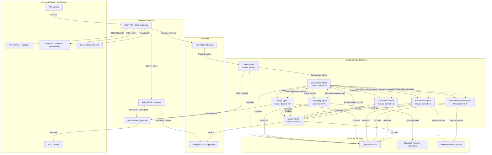
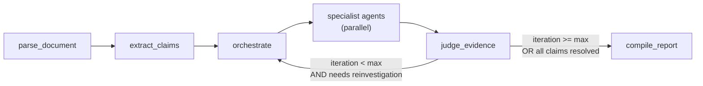

# Sibyl -- Product Requirements Document

| Field | Value |
|---|---|
| **Project** | Sibyl |
| **Hackathon** | Hack for Humanity 2026 |
| **Deadline** | February 28, 2026 |
| **Judging Criteria** | Impact, Innovation/Creativity, Design, Presentation |
| **Version** | 0.3 -- Agent Dashboard Specifications |

---

## Table of Contents

1. [Executive Summary](#1-executive-summary)
2. [Problem Space](#2-problem-space)
3. [User Personas](#3-user-personas)
4. [Product Features](#4-product-features)
5. [Core Technical Pipeline and Architecture](#5-core-technical-pipeline-and-architecture)
6. [High-Level File Structure](#6-high-level-file-structure)
7. [UX and UI Design](#7-ux-and-ui-design)
8. [Non-Functional Requirements](#8-non-functional-requirements)
9. [Appendix](#9-appendix)
10. [References](#10-references)
11. [Assumptions and Dependencies](#11-assumptions-and-dependencies)
12. [Document History and Versioning](#12-document-history-and-versioning)

---

## 1. Executive Summary

### Problem

Corporate sustainability reports are dense documents -- often 100 to 200 pages -- filled with claims about environmental performance, governance structures, strategic commitments, and quantitative targets. These claims are difficult for investors, regulators, and the public to independently verify. The IFRS S1 and S2 sustainability disclosure standards, effective for annual reporting periods beginning on or after 1 January 2024, now mandate specific disclosures across four pillars (Governance, Strategy, Risk Management, and Metrics & Targets) and detailed climate-related content (physical risks, transition risks, GHG emissions by scope, transition plans). Despite these standards, no widely available automated tooling exists to validate whether reported claims are actually supported by real-world evidence or properly aligned with these requirements at the paragraph level.

### Solution

Sibyl is a multi-agent AI orchestration system that ingests sustainability report PDFs, extracts verifiable claims, dispatches specialized investigation agents to gather evidence from diverse real-world sources, and produces a paragraph-level IFRS S1/S2 compliance mapping. Crucially, Sibyl does not only verify the claims a report *does* make -- it also identifies what the report *fails to disclose* by comparing the document's coverage against the full IFRS S1/S2 disclosure requirements and surfacing material omissions as a dedicated "Disclosure Gaps" section in the final output. The entire investigative process is exposed to the user through a live "detective dashboard" -- a network graph visualization showing each agent's reasoning, the evidence flowing between agents, and how claims are being investigated in real time. The final output is a comprehensive, interactive "Source of Truth" report that maps every extracted claim to its relevant IFRS paragraphs, the evidence supporting or contradicting it, a clear compliance verdict, and a disclosure gap analysis highlighting IFRS requirements the report does not address at all.

### Unique Value

Unlike static checklists or keyword matchers, Sibyl deploys investigative AI agents that cross-reference claims against:

- **Satellite imagery** (Microsoft Planetary Computer) for geographic and environmental verification
- **Legal and regulatory databases** (IFRS S1/S2, SASB standards) for compliance mapping
- **News and media archives** for public corroboration or contradiction
- **Academic and industry research** for technical and benchmark validation
- **Quantitative analysis** for mathematical consistency and metrics verification

A dedicated Judge agent evaluates the sufficiency of gathered evidence and can send weak or contradictory findings back to specialist agents for deeper re-investigation, creating a cyclic validation loop. This loop continues until findings are robust or are explicitly marked as having insufficient evidence -- preventing premature or unfounded verdicts.

Beyond claim verification, Sibyl addresses the *selective disclosure* dimension of greenwashing by performing a disclosure gap analysis: the system compares the report's content coverage against the complete set of IFRS S1/S2 disclosure requirements and flags any paragraphs or topics that the report fails to address entirely. This means Sibyl detects both what a company says that is wrong *and* what a company conspicuously chose not to say.

### Hackathon Alignment

- **Impact:** Directly addresses environmental accountability by making greenwashing detectable and sustainability reporting independently verifiable. Supports the global shift toward trustworthy ESG data.
- **Innovation and Creativity:** Multi-agent architecture with cyclic validation, real-time detective dashboard exposing AI reasoning, and paragraph-level IFRS compliance mapping represent a novel approach to sustainability verification.
- **Design:** Interactive compliance report, embedded PDF viewer with claim highlights, animated network-graph dashboard, and contextual chatbot prioritize user experience and information clarity.
- **Presentation:** A full working demo -- from PDF upload through all eight agents to a comprehensive interactive report and chatbot -- supports a clear and compelling demonstration.

---

## 2. Problem Space

### The Greenwashing Epidemic

Misleading or unsubstantiated sustainability claims are pervasive. EU investigations have found that 56% of green claims examined were completely unsubstantiated and 59% were vague, misleading, or unfounded. ESG risk incidents tied to misleading communication on climate, GHG emissions, and pollution affect major sectors: Oil and Gas (72%), Banking and Financial Services (53%), and Travel and Airlines (40%). KPMG's 2024 analysis found that 69% of CEOs have adapted climate-related language to meet stakeholder expectations, while 66% admit they are not prepared to withstand shareholder scrutiny on those claims.

Academic research on firm-level greenwashing identifies two primary manifestations: *selective disclosure* (emphasizing favorable information while omitting unfavorable data) and *decoupling* (a measurable gap between what companies communicate and what they actually do). Most existing greenwashing measures are hypothetical or score-based rather than evidence-based -- researchers construct indices that suggest possible incidents rather than detecting actual greenwashing through verification against real-world evidence. Critically, selective disclosure is not just about making misleading claims -- it is equally about what a report *does not say*. A sustainability report that omits Scope 3 emissions entirely, ignores physical risk exposure, or fails to disclose a transition plan is engaging in selective disclosure just as much as one that exaggerates a renewable energy commitment. Any system that only verifies the claims a company chooses to make, without flagging what is conspicuously absent, addresses only half of the greenwashing problem.

The demand side is equally clear: 70% of consumers want to reduce their environmental impact and rely on corporate sustainability claims to guide decisions, yet without independent verification these reports remain instruments of trust rather than proof.

### IFRS S1 and S2: The Global Disclosure Framework

IFRS S1 (*General Requirements for Disclosure of Sustainability-related Financial Information*) and IFRS S2 (*Climate-related Disclosures*), issued by the International Sustainability Standards Board (ISSB) in June 2023 and effective for annual reporting periods beginning on or after 1 January 2024, form the core global framework for sustainability disclosure.

**IFRS S1 -- The General Framework ("How to Disclose")**

S1 defines the structure and general requirements for all sustainability-related disclosures. It is built on four pillars:

1. **Governance (S1.26-27):** Disclosure of governance processes, controls, and procedures an entity uses to monitor, manage, and oversee sustainability-related risks and opportunities. This includes identifying the governance body or individuals responsible, their competencies, how often they are informed, and how sustainability factors into strategic decisions and remuneration.
2. **Strategy (S1.28-35):** Disclosure of how sustainability-related risks and opportunities affect the entity's business model, value chain, strategy, decision-making, and financial position over short, medium, and long time horizons.
3. **Risk Management (S1.38-42):** Disclosure of the processes used to identify, assess, prioritize, and monitor sustainability-related risks and opportunities, and how these processes are integrated into overall risk management.
4. **Metrics and Targets (S1.43-53):** Disclosure of performance against sustainability-related metrics and progress toward targets set by the entity or required by law or regulation.

S1 requires entities to disclose information about sustainability-related risks and opportunities that could reasonably be expected to affect cash flows, access to finance, or cost of capital over the short, medium, or long term.

**IFRS S2 -- The Climate Module ("What to Disclose for Climate")**

S2 is a topic-based standard that specifies the climate-related content required within the S1 framework. It covers:

- **Climate-related risks:** Physical risks (exposure to climate hazards such as floods, heat, water stress) and transition risks (exposure to the shift toward a lower-carbon economy, including carbon-related assets and regulatory changes)
- **Climate-related opportunities:** Business opportunities arising from climate action
- **Business model and value chain effects (S2.13):** Where climate risks and opportunities are concentrated geographically, by facility, and by asset type
- **Strategy and decision-making (S2.14):** How the entity responds to climate risks, including resource allocation changes, mitigation efforts, and transition plans (S2.14(a)(iv))
- **Financial effects (S2.15-21):** Current and anticipated effects on financial position, performance, and cash flows
- **Climate resilience (S2.22):** Resilience of the entity's strategy to climate scenarios
- **Risk management (S2.24-26):** Climate-specific risk identification and management processes
- **Metrics and targets (S2.27-37):** GHG emissions (Scope 1, Scope 2, Scope 3 by category), emission intensity, climate-related targets and progress, internal carbon pricing, and remuneration tied to climate performance

**How S1 and S2 Interconnect**

S1 and S2 are designed to be used together. S1 defines *how* entities must structure and present sustainability disclosures; S2 defines *what* must be disclosed for climate specifically. Every S2 disclosure requirement maps to its corresponding S1 pillar:

| S1 Pillar | S2 Climate Paragraphs | What S2 Adds |
|---|---|---|
| Governance | S2.5-7 | Climate-specific governance oversight, competencies, remuneration links |
| Strategy | S2.8-23 | Physical/transition risks, business model effects, transition plans, financial effects, climate resilience |
| Risk Management | S2.24-26 | Climate-specific risk identification and integration with overall risk management |
| Metrics & Targets | S2.27-37 | Scope 1/2/3 GHG emissions, emission intensity, climate targets, internal carbon pricing |

A complete compliance picture requires tracing both the structural "how" (S1) and the content "what" (S2) at the paragraph level. Sibyl's Source of Truth output is designed to provide exactly this dual mapping.

### Manual Verification Is Infeasible

A typical 200-page sustainability report contains hundreds of verifiable claims spanning facility locations, emission figures, governance structures, transition plan commitments, financial impact projections, and narrative assertions about environmental performance. Thoroughly verifying these would require cross-referencing each claim against satellite imagery for geographic assertions, regulatory filings for legal compliance, news archives for public corroboration, academic literature and industry benchmarks for technical plausibility, and numerical consistency checks for reported metrics. The volume, variety, and cross-domain nature of these claims make thorough manual verification impractical for most users and even for many professional auditors.

### Gap in Existing Tooling

Current approaches to ESG analysis and sustainability report verification fall into three categories:

1. **Checklist tools:** Simple presence/absence checks for whether certain topics are mentioned. They do not assess whether claims are actually supported by evidence.
2. **Keyword and pattern matchers:** NLP-based tools that extract sustainability-related language but do not verify claims against external sources or check quantitative consistency.
3. **Consultancies and manual auditors:** Human experts who can perform thorough verification but at high cost, long timelines, and limited scalability.

None of these approaches combine multi-agent AI orchestration, real-world evidence gathering across multiple domains (satellite, legal, news, academic, quantitative), cyclic validation with iterative re-investigation, and transparent process exposure in a single system. Sibyl fills this gap.

---

## 3. User Personas

### Primary: ESG Analyst / Sustainability Auditor

Professionals who verify corporate sustainability reports for compliance, investment decisions, or assurance engagements. They need efficient, evidence-based analysis with clear mapping to specific IFRS S1 and S2 paragraphs. They are comfortable with technical dashboards and want to understand exactly how each claim was investigated, which agents contributed evidence, and which IFRS requirements it addresses or fails to meet. They use Sibyl to accelerate due diligence, support audit work, and produce a shareable, defensible Source of Truth report.

**Key needs:** Paragraph-level IFRS traceability, comprehensive evidence chains, ability to filter by pillar and compliance status, exportable results.

**Success metric:** Reduction in manual cross-checking time; increased confidence in compliance assessments; defensible documentation of the verification process.

### Secondary: Corporate Sustainability Officer

Sustainability or ESG leads within companies who want to pre-audit their organization's report before publication or regulatory submission. They need to identify gaps, weak claims, and potential inconsistencies before external scrutiny from regulators, investors, or NGOs. They use Sibyl to stress-test their own narratives and metrics, verify that disclosures align with IFRS S1/S2 requirements, and strengthen the report's credibility before it becomes public.

**Key needs:** Gap identification across IFRS pillars, flagging of unsupported or inconsistent claims, clear indication of which paragraphs are well-covered versus missing.

**Success metric:** Fewer post-publication challenges; improved alignment with IFRS standards; reduced risk of greenwashing accusations.

### Tertiary: Researcher / Journalist / Concerned Citizen

Users who investigate specific companies or industry sectors and want to understand whether sustainability claims hold up to scrutiny. They upload reports themselves and need an approachable UI and the chatbot to ask questions in plain language without requiring deep IFRS or ESG expertise.

**Key needs:** Accessible, interpretable results; plain-language chatbot for Q&A; ability to drill into evidence without technical knowledge.

**Success metric:** Ability to quickly understand whether key claims are supported; access to the underlying evidence and agent reasoning for deeper investigation.

---

## 4. Product Features

### 4.1 PDF Upload and Ingestion

The home page provides a drag-and-drop upload zone for sustainability report PDFs (supporting documents of 100 to 200 pages). Upon upload, the system uses PyMuPDF4LLM to parse the PDF into LLM-ready structured markdown, preserving tables, headings, charts (as text descriptions), and page number references. The extracted content is chunked using hierarchical chunking that preserves document structure (section headers are retained as metadata on each chunk) and stored in PostgreSQL with pgvector embeddings for downstream RAG access. Page-level metadata is maintained on every chunk so that claims can be traced back to their exact location in the original document.

The user sees an upload progress indicator during parsing, and once complete, a preview of the extracted content structure (sections, page count, detected tables) is shown before the user initiates the analysis. The original PDF binary is also stored so it can be rendered in the embedded PDF viewer.

### 4.2 Claims Agent (Document Analysis)

The Claims Agent is the first investigative agent in the pipeline. It receives the full parsed document content and systematically identifies verifiable sustainability claims -- statements that assert facts, metrics, commitments, or conditions that can be checked against external evidence or internal consistency.

**Claim categorization.** Each extracted claim is categorized by type:

- **Geographic:** Facility locations, land use, deforestation commitments, water usage in specific regions
- **Quantitative/Metrics:** Emission figures, percentage targets, financial impacts, year-over-year comparisons, Scope 1/2/3 numbers
- **Legal/Governance:** Board oversight structures, committee responsibilities, compliance assertions, policy commitments
- **Strategic/Forward-looking:** Transition plans, future targets, investment commitments, timeline assertions
- **Environmental:** Biodiversity, waste management, resource efficiency, renewable energy claims

**Claim tagging.** Each claim is tagged with:

- Source page number and text location (for PDF highlighting)
- Preliminary IFRS S1/S2 paragraph mapping (which paragraphs the claim likely relates to)
- Claim type (from the categories above)
- Priority (based on materiality and verifiability)

**PDF highlighting.** Identified claims are highlighted on the original PDF in the embedded viewer. Users can click any highlight to see the agent's reasoning for flagging that particular statement as a verifiable claim, the assigned category, and the preliminary IFRS mapping.

**Model:** Gemini 3 Flash (1M token context window handles full 200-page PDFs in a single pass; cost-effective for large document processing).

### 4.3 Orchestrator Agent (Pipeline Supervisor)

The Orchestrator Agent is the supervisory node in the LangGraph pipeline. It receives the full set of categorized claims from the Claims Agent and manages the downstream investigation flow.

**Routing.** The Orchestrator routes each claim to the appropriate specialist agent(s) based on claim type. A single claim may be routed to multiple agents -- for example, a geographic emissions claim might go to both the Geography Agent and the Data/Metrics Agent. Routing decisions are based on claim type, claim content, and the IFRS paragraphs involved.

**Execution management.** The Orchestrator manages execution priorities, handles agent failures and timeouts (allowing the pipeline to continue even if one agent encounters an error), and tracks overall pipeline state and progress. It maintains a registry of which claims have been assigned to which agents and their current investigation status.

**Inter-agent coordination.** Any specialist agent can request information from any other specialist agent at any time during its investigation. Specialist agents never communicate directly -- all cross-domain requests flow through the Orchestrator. When a specialist agent determines that evidence or context from another domain would strengthen its investigation, it posts a general-purpose `InfoRequest` to the shared LangGraph state. The Orchestrator detects pending requests on its next pass and routes them to the appropriate agent(s), which respond via `InfoResponse` objects in the shared state. This is a fully dynamic, general-purpose mechanism -- there are no hardcoded agent-to-agent channels. The Orchestrator decides routing based on the content of the request, not on predefined pairings.

**Re-investigation handling.** When the Judge Agent sends claims back for re-investigation with refined queries, the Orchestrator receives these requests and re-routes them to the appropriate specialist agent(s) with the Judge's specific guidance on what additional evidence is needed.

**Model:** Claude Sonnet 4.5 (strong reasoning for complex routing decisions and coordination logic; improved agentic capabilities over Sonnet 4).

### 4.4 Geography Agent (Satellite Verification)

The Geography Agent investigates geographic and environmental claims by analyzing satellite imagery from Microsoft Planetary Computer (MPC).

**Claim types handled:** Facility locations, land use assertions, deforestation commitments, reforestation claims, water usage in specific regions, geographic concentration of climate risks, and physical risk exposure (e.g., flood-prone areas).

**Satellite data access.** The agent queries MPC via the pystac-client Python library for Sentinel-2 multispectral satellite imagery of the locations specified in claims. MPC requires no API key and is free for non-commercial use, making it ideal for a hackathon project. The agent can search by geographic coordinates (derived from location names via geocoding), time range, and collection type.

**Analysis capabilities:**

- Vegetation change detection (NDVI analysis) to verify deforestation or reforestation claims
- Land cover classification to confirm facility presence or land use
- Temporal comparison (before/after imagery) to verify environmental commitments over stated time periods
- Environmental impact indicators (water body changes, urban expansion, industrial activity)

**Evidence output.** The agent returns its findings with satellite image references, analysis results, temporal comparisons, and a plain-language summary of whether the geographic evidence supports or contradicts the claim.

**Inter-agent communication.** Like all specialist agents, the Geography Agent participates in the general inter-agent communication protocol (see Section 5.4). It can receive information requests from any other specialist agent via the Orchestrator and post its own requests when it needs cross-domain context -- for example, requesting clarification on a claimed facility's operational status or the regulatory context of a geographic assertion. All such communication flows through the shared state and is mediated by the Orchestrator.

**Model:** Gemini 2.5 Pro (best available multimodal/vision capabilities for analyzing satellite imagery; strong spatial reasoning).

### 4.5 Legal Agent (Compliance and Governance)

The Legal Agent investigates legal, regulatory, and governance-related claims against IFRS S1/S2 requirements and related standards.

**RAG knowledge base.** The Legal Agent has retrieval access to:

- Full IFRS S1 standard text (all paragraphs, appendices, and application guidance)
- Full IFRS S2 standard text (including industry-based guidance on implementing S2)
- SASB industry-specific disclosure standards (sector-relevant metrics and topics)
- Relevant regulatory frameworks and interpretive guidance

**Investigation scope:**

- Whether disclosed governance structures meet S1.26-27 and S2.5-7 requirements (board oversight, competencies, frequency of reporting, integration with remuneration)
- Whether risk management disclosures satisfy S1.38-42 and S2.24-26 (risk identification processes, integration with overall risk management)
- Whether strategic disclosures meet S2.14 requirements (response to climate risks, transition plans, resource allocation)
- Whether disclosed metrics align with the methodologies and granularity required by S2.27-37
- General legal compliance assertions (certifications, regulatory adherence, policy commitments)

**Paragraph-level mapping.** The Legal Agent produces precise paragraph-level mappings -- for example, identifying that a transition plan disclosure maps to S2.14(a)(iv) and checking whether it meets the specific requirements of that paragraph (key assumptions, dependencies, timeline).

**Disclosure gap detection (omission analysis).** In addition to evaluating claims that are present, the Legal Agent performs a systematic coverage analysis by comparing the full set of IFRS S1/S2 disclosure requirements (at the paragraph level) against the claims and content extracted from the report. Any IFRS paragraph that has no corresponding content in the report is flagged as a disclosure gap. This directly addresses the *selective disclosure* form of greenwashing -- detecting what a report chose not to say. For example, if a report discusses Scope 1 and Scope 2 GHG emissions but makes no mention of Scope 3 emissions at all, the Legal Agent flags the S2.29(a)(iii) requirement as an unaddressed disclosure gap. The output distinguishes between:

- **Fully unaddressed:** The IFRS paragraph has zero corresponding content in the report
- **Partially addressed:** The report touches on the topic but does not meet the paragraph's specific sub-requirements (e.g., a transition plan is mentioned but lacks the key assumptions and dependencies required by S2.14(a)(iv))

**Inter-agent communication.** Like all specialist agents, the Legal Agent participates in the general inter-agent communication protocol (see Section 5.4). It can post information requests to any other specialist agent via the Orchestrator when it needs cross-domain context to complete its assessment -- for example, requesting geographic verification of a facility claim, quantitative validation of reported metrics, or corroborating news coverage for a governance assertion. All such communication flows through the shared state and is mediated by the Orchestrator.

**Model:** Claude Sonnet 4.5 (excellent legal and compliance reasoning; strong at interpreting regulatory language and assessing nuanced governance structures).

### 4.6 News/Media Agent (Public Source Verification)

The News/Media Agent scours public news sources, press releases, and investigative journalism for corroboration or contradiction of specific claims.

**Source types and credibility weighting:**

- Tier 1 (highest weight): Major investigative journalism outlets, regulatory enforcement actions, court filings
- Tier 2: Established news organizations, industry trade publications, government reports
- Tier 3: Press releases from the company itself, wire services, analyst reports
- Tier 4 (lowest weight): Blogs, social media, unverified sources

**Investigation scope:**

- Company-specific news coverage related to sustainability claims
- Industry-wide incidents, regulatory actions, and enforcement patterns
- Whistleblower reports and investigative journalism findings
- Historical controversies or legal actions related to environmental or governance claims
- Public statements by company executives that may corroborate or contradict report claims

**Evidence output.** Each piece of evidence includes the source URL, publication date, source credibility tier, relevance to the specific claim, and a plain-language summary of what the source says. The agent flags cases where public reporting directly contradicts claims made in the sustainability report.

**Inter-agent communication.** Like all specialist agents, the News/Media Agent participates in the general inter-agent communication protocol (see Section 5.4). It can post information requests to any other specialist agent via the Orchestrator when cross-domain context would strengthen its investigation -- for example, requesting geographic confirmation of an incident location or regulatory context for a reported enforcement action. All such communication flows through the shared state and is mediated by the Orchestrator.

**Model:** Claude Sonnet 4.5 (strong at source analysis, credibility assessment, and nuanced reasoning about corroboration versus contradiction).

### 4.7 Academic/Industry Research Agent (Technical Verification)

The Academic/Industry Research Agent validates technical and scientific claims against peer-reviewed research, industry benchmarks, and recognized standards.

**Source types:**

- Peer-reviewed academic papers on emissions methodologies, climate science, and sustainability metrics
- Industry benchmark reports (sector-specific emission intensities, best practices)
- CDP (Carbon Disclosure Project) disclosures from comparable companies
- SASB metrics and industry-specific disclosure guidance
- Science Based Targets initiative (SBTi) methodologies and target validation frameworks
- GHG Protocol standards and guidance for Scope 1, 2, and 3 calculations

**Investigation scope:**

- Whether claimed emission reduction methodologies are scientifically valid and recognized
- Whether renewable energy certifications and carbon offset claims are legitimate
- Whether stated science-based targets align with SBTi frameworks
- Whether reported emission intensities are plausible for the company's industry sector
- Whether claimed technologies or practices are supported by peer-reviewed research

**Evidence output.** The agent returns findings with academic references, benchmark comparisons, methodology assessments, and a plain-language summary of whether the technical evidence supports the claim.

**Inter-agent communication.** Like all specialist agents, the Academic/Industry Research Agent participates in the general inter-agent communication protocol (see Section 5.4). It can post information requests to any other specialist agent via the Orchestrator and receive requests from any agent that needs technical context, benchmark data, or methodology validation. All such communication flows through the shared state and is mediated by the Orchestrator.

**Model:** DeepSeek V3.2 (fast and cost-effective for research synthesis and benchmark comparison; strong at processing academic and technical content).

### 4.8 Data/Metrics Agent (Quantitative Validation)

The Data/Metrics Agent validates all numerical and quantitative claims for mathematical consistency, methodological alignment, and benchmark plausibility.

**Investigation scope:**

- **Internal consistency:** Do reported Scope 1 + Scope 2 + Scope 3 totals add up? Do year-over-year percentage changes match the underlying numbers? Are base years and recalculation adjustments applied consistently?
- **Unit and methodology validation:** Are emissions reported in correct units (tCO2e)? Are conversion factors appropriate? Does the methodology align with the GHG Protocol?
- **Benchmark comparison:** Are reported emission intensities, energy consumption figures, and financial impacts plausible for the company's industry sector and size?
- **Target assessment:** Are reduction targets mathematically achievable given stated baselines and timelines? Are interim targets consistent with long-term goals?
- **Historical consistency:** Do reported figures align with or explain deviations from previously published reports?

**IFRS S2 Metrics and Targets focus.** This agent is critical for assessing compliance with S2.27-37, which requires disclosure of absolute Scope 1/2/3 GHG emissions, emission intensity metrics, climate-related targets (including baseline periods, milestones, and progress), internal carbon pricing, and whether climate performance is linked to remuneration.

**Evidence output.** The agent returns mathematical verification results, benchmark comparisons, identified inconsistencies, and specific references to which S2 paragraph requirements are met or unmet by the reported metrics.

**Inter-agent communication.** Like all specialist agents, the Data/Metrics Agent participates in the general inter-agent communication protocol (see Section 5.4). It can post information requests to any other specialist agent via the Orchestrator when cross-domain context would aid its analysis -- for example, requesting industry benchmarks for plausibility checks or geographic data for location-specific emissions validation. All such communication flows through the shared state and is mediated by the Orchestrator.

**Model:** Claude Sonnet 4.5 (strong numerical reasoning, consistency checking, and ability to work with complex financial and emissions data).

### 4.9 Judge Agent (Cyclic Validation)

The Judge Agent is the final evaluative node in the pipeline and the mechanism that enables Sibyl's cyclic validation loop.

**Evidence evaluation.** For each claim, the Judge receives all evidence gathered by the specialist agents. It evaluates:

- **Sufficiency:** Is there enough evidence to reach a verdict? Are multiple independent sources corroborating the claim?
- **Consistency:** Do findings from different agents align, or are there contradictions?
- **Quality:** Are the sources credible? Is the evidence direct or circumstantial?
- **Completeness:** Have all relevant angles been investigated? Is there a domain that should have been consulted but was not?

**Cyclic re-investigation.** If evidence is insufficient, contradictory, or incomplete, the Judge does not issue a premature verdict. Instead, it sends specific re-investigation requests back to the Orchestrator, which routes them to the appropriate specialist agent(s). These requests include:

- Which agent(s) should re-investigate
- What specific evidence gap needs to be addressed
- Refined search queries or investigation angles
- What would constitute sufficient evidence to resolve the issue

The maximum iteration depth is configurable (default: 3 cycles) to prevent infinite loops while allowing thorough investigation of complex claims.

**Final verdicts.** After sufficient investigation (or upon reaching the maximum iteration depth), the Judge produces a final verdict for each claim:

- **Verified:** Multiple independent sources corroborate the claim; no contradictions found
- **Unverified:** No external evidence could be found to support or contradict the claim
- **Contradicted:** Evidence from one or more sources directly contradicts the claim
- **Insufficient Evidence:** Some evidence exists but is not sufficient to reach a confident verdict

Each verdict is mapped to the specific IFRS S1/S2 paragraphs that the claim relates to, creating the paragraph-level compliance mapping that forms the core of the Source of Truth report.

**Model:** Claude Opus 4.5 (highest-quality reasoning for nuanced judgment calls; ability to weigh contradictory evidence and make defensible final assessments).

### 4.10 Detective Dashboard (Real-Time Agent Visualization)

The detective dashboard is the hero visual of Sibyl -- a real-time, interactive network graph that exposes the full multi-agent investigation process to the user.

**Network graph.** Built with React Flow, the dashboard displays:

- **Agent nodes:** Each agent (Claims, Orchestrator, Geography, Legal, News/Media, Academic/Research, Data/Metrics, Judge) is represented as a node with a unique color identity
- **Claim/evidence edges:** Animated edges show claims and evidence flowing between agents as the analysis progresses
- **Real-time updates:** The graph updates live via Server-Sent Events (SSE) streaming from the LangGraph backend, showing data flowing as it happens

**Agent node interaction.** Each agent node is expandable to reveal:

- Current status (idle, working, completed, error)
- The agent's active reasoning stream (what it is currently investigating and thinking)
- Summary of findings so far
- Number of claims being investigated

Beyond these shared elements, select agents display domain-specific content that would lose meaning if reduced to text-only reasoning:

- **Geography Agent:** Renders the satellite image tile currently being analyzed (retrieved from Microsoft Planetary Computer) with a caption showing the location name, coordinates, and imagery date. For temporal claims, shows a before/after image pair.
- **Legal Agent:** Shows a compact IFRS coverage progress bar per pillar (Governance, Strategy, Risk Management, Metrics & Targets) that fills in as paragraphs are evaluated -- green for covered, orange for partial, grey for gaps.
- **Data/Metrics Agent:** Displays a running list of consistency checks (e.g., "Scope 1 + 2 + 3 = Total") with pass/fail indicators, so users can see quantitative validation results at a glance.
- **Judge Agent:** Shows verdict cards as they are issued -- each card displays the claim, the color-coded verdict badge (Verified/Unverified/Contradicted/Insufficient Evidence), and the cycle count if re-investigation was requested.

**Visual indicators:**

- Agent status: Pulsing animation when active, solid when idle, checkmark when complete, warning icon on error
- Claim flow: Animated particles along edges showing data movement direction and volume
- Cyclic validation: Re-investigation loops are visually highlighted with a distinct animation when the Judge sends claims back to the Orchestrator
- Inter-agent communication: Information requests and responses routed through the Orchestrator are shown as edges flowing through the Orchestrator node

**Edge interaction.** Users can click on any edge to see the message or data being passed between agents -- the specific claim being routed, the evidence being shared, or the re-investigation request being sent.

**Transparency goal.** The detective dashboard makes Sibyl's investigative process fully transparent. Users are not presented with a black-box verdict; they can watch every step of the investigation, understand why each agent was consulted, see what evidence was gathered, and observe the Judge's reasoning for its verdicts.

### 4.11 Source of Truth Output (Interactive Compliance Report)

The Source of Truth is the primary output of Sibyl -- a comprehensive, interactive compliance report that maps every extracted claim to IFRS S1/S2 requirements and the evidence gathered during investigation.

**Organization by IFRS pillars.** The report is structured around the four S1 pillars, with S2 climate-specific content nested within each:

- **Governance:** Claims related to S1.26-27 and S2.5-7 (oversight bodies, competencies, reporting frequency, remuneration links)
- **Strategy:** Claims related to S1.28-35 and S2.8-23 (risks and opportunities, business model effects, transition plans, financial effects, climate resilience)
- **Risk Management:** Claims related to S1.38-42 and S2.24-26 (risk identification processes, integration with overall risk management)
- **Metrics and Targets:** Claims related to S1.43-53 and S2.27-37 (GHG emissions, intensity metrics, targets, internal carbon pricing)

**Claim cards.** Each claim is displayed as a card showing:

- The original claim text with a link to its location in the PDF viewer
- The IFRS S1/S2 paragraph(s) it maps to (with paragraph identifiers like S2.14(a)(iv))
- Evidence gathered by each agent that investigated the claim (expandable sections)
- The full agent reasoning chain (which agents were consulted, what they found, whether re-investigation was requested)
- The Judge's final verdict (Verified, Unverified, Contradicted, Insufficient Evidence)
- Color-coded compliance status: green (verified), yellow (unverified or insufficient evidence), red (contradicted)

**S1/S2 cross-mapping.** The report shows how each S2 climate disclosure fulfills its corresponding S1 general requirement, making the interconnection between the two standards explicit and traceable.

**Disclosure Gaps section ("What the report does NOT disclose").** A dedicated section of the Source of Truth report surfaces IFRS S1/S2 requirements that the report fails to address. This section is organized by IFRS pillar and lists every paragraph-level requirement that has no corresponding content in the uploaded report (fully unaddressed) or that is only partially covered (the topic is mentioned but specific sub-requirements are missing). Each gap entry includes:

- The IFRS paragraph identifier and a plain-language description of what the standard requires
- Whether the gap is a full omission or a partial coverage gap, with specifics on which sub-requirements are missing
- The materiality context -- why this omission matters (e.g., "Scope 3 emissions typically represent the majority of a company's total GHG footprint; omitting them understates climate exposure")
- Color-coded severity: grey (fully unaddressed) and orange (partially addressed)

This section directly addresses the *selective disclosure* form of greenwashing by making it impossible to overlook what a company chose not to report. A report that appears compliant based on its claims alone may reveal significant gaps when measured against the full IFRS requirement set.

**Filtering and search.** Users can filter and search by IFRS pillar, claim type, compliance status (verdict), investigating agent, specific IFRS paragraph number, and disclosure gap status.

**Comprehensiveness.** The Source of Truth report is comprehensive and does not degrade the complexity of the underlying document. Every verifiable claim identified by the Claims Agent is present, fully mapped, and fully investigated. Every IFRS S1/S2 disclosure requirement is accounted for -- either mapped to claims in the report or surfaced as a disclosure gap. The report serves as a complete compliance analysis covering both what the report says and what it does not say.

### 4.12 Chatbot (Contextual Q&A)

A conversational interface that allows users to ask questions about the analyzed report and receive contextual, evidence-backed answers.

**RAG-powered retrieval.** The chatbot uses Retrieval-Augmented Generation with pgvector to search across:

- The original sustainability report content (chunked and embedded during ingestion)
- All agent findings and evidence gathered during the investigation
- The IFRS S1/S2 standard texts and SASB guidance
- The Source of Truth report verdicts, reasoning, and disclosure gap analysis

**Example queries:**

- "What evidence supports the company's Scope 3 emission reduction claim?"
- "Does the report meet S2.14(a)(iv) transition plan requirements?"
- "What did the Geography Agent find about the Borneo facility?"
- "Which claims were contradicted by news sources?"
- "What are the main compliance gaps in the Governance pillar?"
- "What IFRS requirements does this report not address at all?"
- "Does the report disclose Scope 3 emissions by category as required by S2.29(a)(iii)?"

**Contextual awareness.** The chatbot understands the structure of the analysis -- it can reference specific agents, specific claims, specific IFRS paragraphs, specific evidence, and disclosure gaps. It provides answers grounded in the actual analysis results, not generic information.

**Accessibility.** The chatbot is accessible as a slide-out panel from any view in the application, persisting across navigation so users can ask questions while reviewing the PDF, the detective dashboard, or the Source of Truth report.

**Model:** Gemini 3 Flash (cost-effective with strong context handling; good for conversational Q&A with RAG retrieval).

---

## 5. Core Technical Pipeline and Architecture

### 5.1 Tech Stack

| Layer | Technology | Purpose |
|---|---|---|
| **Frontend** | React (TypeScript) + Vite | Single-page application with fast HMR |
| **UI Components** | shadcn/ui + TailwindCSS v4 | Design system with dark-mode-first theme |
| **Graph Visualization** | React Flow (@xyflow/react) | Detective dashboard network graph |
| **PDF Viewer** | @pdf-viewer/react | Embedded PDF with annotation/highlight overlays |
| **Backend** | FastAPI | Async Python API server |
| **Validation** | Pydantic v2 | Request/response schema validation |
| **ORM** | SQLAlchemy 2.1 + Alembic | Database models and migrations |
| **Database** | PostgreSQL 17 + pgvector | Unified relational store and vector store |
| **AI Orchestration** | LangGraph (v1.0) | Graph-based state machine with cyclic workflow support |
| **LLM Integration** | LangChain | RAG pipelines, tool definitions, prompt management |
| **LLM Gateway** | OpenRouter API | Unified access to all models (Claude, Gemini, DeepSeek) |
| **PDF Parsing** | PyMuPDF4LLM | Structured markdown extraction from PDFs |
| **Satellite Imagery** | Microsoft Planetary Computer | Sentinel-2 imagery via pystac-client (no API key) |
| **Embeddings** | OpenAI text-embedding-3-small | Vector embeddings for RAG (via OpenRouter) |
| **Streaming** | Server-Sent Events (SSE) | Real-time agent thought streaming to frontend |
| **Task Queue** | Redis | Background job processing for PDF pipelines |
| **Deployment** | Docker Compose | Single-command orchestration of all services |

**Why these choices:**

- **LangGraph over CrewAI/AutoGen:** LangGraph natively supports cyclic workflows (critical for the Judge agent's re-investigation loop), explicit graph-based state machines (matching our agent pipeline architecture), built-in streaming via callbacks (for the detective dashboard), and checkpointing (for fault tolerance). CrewAI lacks the cyclic control flow needed; AutoGen's event-driven model is more complex than needed for this use case.
- **pgvector over separate vector DBs:** Since the backend already uses PostgreSQL via SQLAlchemy, pgvector keeps everything in one database with ACID compliance, audit trails, and the ability to join vector search results with relational data (e.g., linking embeddings to specific claims, reports, and agent findings). For the scale of a hackathon project (hundreds of documents, not millions), pgvector's performance (v0.8.0 with iterative index scans) is more than sufficient.
- **SSE over WebSockets:** Agent thought streaming is unidirectional (server to client). SSE is simpler to implement with FastAPI's StreamingResponse, auto-reconnects on network issues, and works well with React's EventSource API. WebSockets would add bidirectional complexity with no benefit for this use case.
- **OpenRouter as unified gateway:** Allows accessing Claude (Sonnet 4.5, Opus 4.5), Gemini (3 Flash, 2.5 Pro), DeepSeek (V3.2), and other models through a single API with consistent authentication and billing, eliminating the need for separate API keys and SDKs per provider.

### 5.2 Architecture Diagram



### 5.3 LangGraph State Machine Design

The multi-agent pipeline is implemented as a LangGraph StateGraph with the following structure:

**Shared state schema.** A Pydantic model that serves as the single source of truth for the entire pipeline execution:

```python
class SibylState(BaseModel):
    # Input
    report_id: str
    document_content: str
    document_chunks: list[DocumentChunk]

    # Claims Agent output
    claims: list[Claim]  # Each has: text, page, type, ifrs_paragraphs, priority

    # Orchestrator tracking
    routing_plan: list[RoutingAssignment]  # claim_id -> agent(s)
    agent_status: dict[str, AgentStatus]   # agent_name -> status

    # Specialist agent findings
    findings: list[AgentFinding]  # agent, claim_id, evidence, summary

    # Inter-agent communication
    info_requests: list[InfoRequest]   # agent -> agent requests
    info_responses: list[InfoResponse] # responses to requests

    # Judge Agent
    verdicts: list[ClaimVerdict]  # claim_id, verdict, reasoning, ifrs_mapping
    reinvestigation_requests: list[ReinvestigationRequest]
    iteration_count: int  # Current cycle number
    max_iterations: int   # Default: 3

    # Streaming
    events: list[StreamEvent]  # Emitted to frontend via SSE
```

**Graph nodes.** Each agent is a node (Python function) that reads from and writes to the shared state:

- `parse_document` -- Ingests PDF, produces structured content and chunks
- `extract_claims` -- Claims Agent node
- `orchestrate` -- Orchestrator node (routing and coordination)
- `investigate_geography` -- Geography Agent node
- `investigate_legal` -- Legal Agent node
- `investigate_news` -- News/Media Agent node
- `investigate_academic` -- Academic/Research Agent node
- `investigate_data` -- Data/Metrics Agent node
- `judge_evidence` -- Judge Agent node
- `compile_report` -- Compiles final Source of Truth output

**Graph edges and control flow:**



- **Conditional routing from Orchestrator:** The orchestrate node uses conditional edges to fan out to the appropriate specialist agent nodes based on claim types. Specialist agents run in parallel where possible.
- **Conditional edge from Judge:** After evaluation, a conditional edge checks whether (a) there are re-investigation requests AND (b) the iteration count is below the maximum. If both conditions are true, the edge routes back to the Orchestrator (creating the cycle). Otherwise, it routes to the compile_report terminal node.
- **Streaming callbacks:** Every node emits StreamEvent objects to the state, which are picked up by a LangGraph callback handler and forwarded to the FastAPI SSE endpoint in real time.

**Checkpointing.** LangGraph's PostgreSQL checkpointer is used to persist state after each node execution, enabling:

- Fault tolerance: If the pipeline crashes, it can resume from the last checkpoint
- Debugging: Developers can inspect the state at any point in the pipeline
- Replay: The detective dashboard can replay a completed analysis step by step

### 5.4 Inter-Agent Communication

Specialist agents do not communicate directly. All inter-agent communication flows through the shared LangGraph state, mediated by the Orchestrator. This is a fully general, dynamic mechanism -- any specialist agent can request information from any other specialist agent. There are no hardcoded agent-to-agent channels or predefined communication pairs. The Orchestrator determines routing based on the content and context of each request.

**Communication protocol:**

1. **Information requests:** During its investigation, any specialist agent can determine that cross-domain context would strengthen its findings. It posts a general-purpose `InfoRequest` to the shared state, describing what information it needs and why. The request is not addressed to a specific agent -- the Orchestrator decides which agent(s) are best positioned to respond.
2. **Orchestrator routing:** On its next pass, the Orchestrator detects pending `InfoRequest` objects, analyzes their content, and routes each request to the most appropriate specialist agent(s). The Orchestrator may route a single request to multiple agents if the question spans domains.
3. **Information responses:** The target agent(s) process the request and post `InfoResponse` objects to the shared state, which become available to the requesting agent on its next execution.
4. **State-based visibility:** All inter-agent communication -- requests, routing decisions, and responses -- is recorded in the shared state and streamed to the detective dashboard, making cross-domain collaboration fully visible and auditable.

**Design rationale.** This architecture keeps agents loosely coupled (they only interact through the state and never reference each other directly), makes all communication auditable and visible in the detective dashboard, and leverages LangGraph's built-in state management rather than requiring a custom message bus. Because routing is handled dynamically by the Orchestrator, adding new specialist agents in the future requires no changes to existing agents -- they automatically become available for cross-domain communication.

### 5.5 RAG Pipeline Architecture

**Corpus.** The RAG knowledge base contains three categories of content:

1. **IFRS Standards:** Full text of IFRS S1 and S2 (all paragraphs, appendices, application guidance, and illustrative examples), chunked at the paragraph level with metadata preserving paragraph numbers, section hierarchy, and pillar classification.
2. **SASB Standards:** Industry-specific disclosure standards from SASB, chunked by disclosure topic with metadata for industry sector and metric type.
3. **Report Content:** The uploaded sustainability report, chunked using hierarchical chunking that preserves document structure (section headers, page numbers, table boundaries as metadata).

**Embedding and storage.** All chunks are embedded using OpenAI text-embedding-3-small (via OpenRouter) and stored in PostgreSQL with the pgvector extension. Each embedding vector is stored alongside its source text, metadata (paragraph number, page, section, document type), and a foreign key linking it to its parent document or standard.

**Retrieval strategy.** Hybrid search combining:

- Semantic search (cosine similarity on pgvector embeddings) for meaning-based retrieval
- Keyword search (PostgreSQL full-text search with ts_vector) for precise term matching (e.g., specific paragraph numbers like "S2.14(a)(iv)")
- Results are combined and re-ranked by relevance before being passed to the requesting agent or chatbot

**Consumers:**

- **Legal Agent:** Retrieves specific IFRS paragraphs and SASB standards relevant to each claim
- **Claims Agent:** Retrieves IFRS paragraph descriptions for preliminary claim-to-paragraph mapping
- **Chatbot:** Retrieves report content, agent findings, and IFRS standards to answer user questions
- **Data/Metrics Agent:** Retrieves methodology guidance from GHG Protocol and SASB metrics standards

### 5.6 Model Selection and Rationale

| Agent | Model | Rationale | Approx. Cost (per 1M tokens in/out) |
|---|---|---|---|
| Claims Agent | Gemini 3 Flash | 1M token context window handles full 200-page PDFs; fast for large input | ~$0.50 / $3.00 |
| Orchestrator | Claude Sonnet 4.5 | Strong reasoning for routing decisions and coordination logic; improved agentic capabilities | ~$3 / $15 |
| Geography Agent | Gemini 2.5 Pro | Best multimodal/vision capabilities for satellite image analysis | ~$1.25 / $10 |
| Legal Agent | Claude Sonnet 4.5 | Excellent legal reasoning and regulatory interpretation | ~$3 / $15 |
| News/Media Agent | Claude Sonnet 4.5 | Strong source analysis and credibility assessment | ~$3 / $15 |
| Academic/Research Agent | DeepSeek V3.2 | Fast and cost-effective for research synthesis | ~$0.25 / $0.38 |
| Data/Metrics Agent | Claude Sonnet 4.5 | Strong numerical reasoning and consistency checking | ~$3 / $15 |
| Judge Agent | Claude Opus 4.5 | Highest-quality reasoning for final judgment calls | ~$5 / $25 |
| Chatbot | Gemini 3 Flash | Fast conversational Q&A with good context handling | ~$0.50 / $3.00 |
| Embeddings | text-embedding-3-small | Cost-effective embeddings with strong retrieval quality | ~$0.02 / N/A |

Quality-first strategy: Premium models (Claude Opus 4.5, Claude Sonnet 4.5) are used for critical reasoning tasks (judgment, legal analysis, orchestration), while faster models (Gemini 3 Flash, DeepSeek V3.2) handle high-volume tasks (document parsing, research synthesis, chatbot conversations).

---

## 6. High-Level File Structure

```
sibyl/
    frontend/
        public/                         # Static assets, favicon
        src/
            components/
                Dashboard/              # Detective dashboard (React Flow network graph)
                    AgentNode.tsx        # Custom React Flow node for each agent
                    ClaimEdge.tsx        # Animated edge showing claim/evidence flow
                    DashboardGraph.tsx   # Main graph canvas and layout
                    AgentPanel.tsx       # Expandable panel showing agent reasoning
                PDFViewer/
                    PDFViewer.tsx        # Embedded PDF renderer
                    ClaimHighlight.tsx   # Overlay highlights on PDF pages
                    HighlightTooltip.tsx # Tooltip showing claim details on click
                SourceOfTruth/
                    ComplianceReport.tsx # Main report view organized by pillars
                    PillarSection.tsx    # Section for each IFRS pillar
                    ClaimCard.tsx        # Individual claim with verdict and evidence
                    EvidencePanel.tsx    # Expandable evidence chain viewer
                    FilterBar.tsx        # Filter/search by pillar, status, paragraph
                Chatbot/
                    ChatPanel.tsx        # Slide-out chatbot panel
                    ChatMessage.tsx      # Individual message bubble
                    ChatInput.tsx        # User input with send button
                Upload/
                    UploadZone.tsx       # Drag-and-drop upload component
                    UploadProgress.tsx   # Progress indicator during parsing
                    ContentPreview.tsx   # Preview of extracted structure
                Layout/
                    AppShell.tsx         # Main layout shell with navigation
                    Sidebar.tsx          # Navigation sidebar
                    Header.tsx           # Top header bar
            hooks/
                useSSE.ts               # SSE connection for agent streaming
                useAnalysis.ts          # Analysis state management
                useChat.ts              # Chatbot conversation state
            services/
                api.ts                  # REST API client (axios/fetch)
                sse.ts                  # SSE client for detective dashboard
            types/
                claim.ts                # Claim, ClaimType, ClaimVerdict types
                agent.ts                # Agent, AgentStatus, AgentFinding types
                ifrs.ts                 # IFRS pillar, paragraph mapping types
                report.ts               # Report, SourceOfTruth types
            pages/
                HomePage.tsx            # Upload landing page
                AnalysisPage.tsx        # 3-panel analysis view
                ReportPage.tsx          # Source of Truth report view
            App.tsx                     # Root component with routing
            main.tsx                    # Entry point
        index.html
        package.json
        tsconfig.json
        vite.config.ts
        Dockerfile

    backend/
        app/
            api/
                routes/
                    upload.py           # PDF upload endpoint
                    analysis.py         # Start analysis, get status
                    stream.py           # SSE streaming endpoint
                    report.py           # Source of Truth report endpoints
                    chat.py             # Chatbot conversation endpoint
                deps.py                 # FastAPI dependency injection
            agents/
                state.py                # SibylState Pydantic schema
                graph.py                # LangGraph graph definition and compilation
                claims_agent.py         # Claims extraction agent node
                orchestrator_agent.py   # Pipeline supervisor agent node
                geography_agent.py      # Satellite verification agent node
                legal_agent.py          # Compliance/governance agent node
                news_media_agent.py     # News/media verification agent node
                academic_agent.py       # Academic/research verification agent node
                data_metrics_agent.py   # Quantitative validation agent node
                judge_agent.py          # Cyclic validation judge agent node
                tools/
                    search_web.py       # Web search tool for News/Academic agents
                    query_mpc.py        # Microsoft Planetary Computer query tool
                    rag_lookup.py       # RAG retrieval tool for Legal/Claims agents
            services/
                pdf_parser.py           # PyMuPDF4LLM integration
                rag_service.py          # Embedding, chunking, retrieval logic
                satellite_service.py    # MPC integration and image processing
                openrouter_client.py    # OpenRouter API wrapper
                report_compiler.py      # Source of Truth report compilation
            models/
                report.py               # Report SQLAlchemy model
                claim.py                # Claim SQLAlchemy model
                finding.py              # AgentFinding SQLAlchemy model
                verdict.py              # ClaimVerdict SQLAlchemy model
                embedding.py            # Embedding/chunk SQLAlchemy model
            schemas/
                upload.py               # Upload request/response schemas
                analysis.py             # Analysis status schemas
                report.py               # Report response schemas
                chat.py                 # Chat request/response schemas
            core/
                config.py               # Settings (env vars, OpenRouter key, DB URL)
                database.py             # SQLAlchemy engine, session, Base
                dependencies.py         # Shared dependencies
        data/
            ifrs/
                s1_full.md              # IFRS S1 standard text for RAG corpus
                s2_full.md              # IFRS S2 standard text for RAG corpus
                s1_s2_mapping.json      # S1-S2 cross-reference mapping
            sasb/                       # SASB industry standards (by sector)
        alembic/
            versions/                   # Migration files
            env.py
        alembic.ini
        requirements.txt
        Dockerfile

    docker-compose.yml                  # PostgreSQL + Redis + Backend + Frontend
    .env.example                        # Environment variable template
    README.md                           # Project overview and setup instructions
```

---

## 7. UX and UI Design

### 7.1 Design System

- **Framework:** shadcn/ui component library on top of TailwindCSS
- **Theme:** Dark mode as the default, fitting the "detective/investigation" aesthetic. Deep charcoal backgrounds with high-contrast text and vivid accent colors.
- **Agent color identity:** Each agent has a unique, consistent accent color used across the detective dashboard, Source of Truth report, and evidence panels:
  - Claims Agent: Slate blue
  - Orchestrator: White/silver
  - Geography Agent: Forest green
  - Legal Agent: Deep purple
  - News/Media Agent: Amber/gold
  - Academic/Research Agent: Teal
  - Data/Metrics Agent: Coral/orange
  - Judge Agent: Crimson red
- **Typography:** Clean sans-serif (Inter or system font stack) with clear hierarchy between headings, body text, and metadata
- **Spacing and density:** Medium density -- detailed enough for professional use but not overwhelming. Generous whitespace between major sections, compact within data-rich areas.

### 7.2 Page Layouts

**Home Page**

A clean, modern landing page with two zones:

1. **Hero section:** Project name, tagline, and a brief one-paragraph explanation of what Sibyl does
2. **Upload zone:** Large, centered drag-and-drop area with visual feedback on hover and drop. Accepts PDF files. Shows upload progress and parsing status after file is dropped.

**Analysis Page (3-Panel Layout)**

The primary working view during and after analysis, with three resizable panels:

- **Left panel -- PDF Viewer:** The original uploaded PDF rendered in an embedded viewer. Claims identified by the Claims Agent are highlighted with colored overlays. Clicking a highlight opens a tooltip showing the claim text, category, preliminary IFRS mapping, and the Claims Agent's reasoning for flagging it. The viewer supports page navigation and zoom.
- **Center panel -- Detective Dashboard:** The React Flow network graph occupying the central focus. Agent nodes are arranged in a logical flow (Claims at top, Orchestrator below, specialist agents in a row, Judge at bottom, with a visible cycle arrow back to Orchestrator). Animated edges show real-time data flow. Clicking any node expands it to show the agent's current reasoning stream. Clicking any edge shows the data being passed. The graph pulses and animates during active investigation.
- **Right panel -- Agent Reasoning:** A streaming text panel showing the currently-active agent's detailed reasoning. As agents work, their thoughts appear here in real time (streamed via SSE). Users can switch between agents using tabs at the top of the panel to review any agent's full reasoning history.

**Source of Truth Page**

A full-width interactive dashboard:

- **Pillar tabs or sections:** Four major sections (Governance, Strategy, Risk Management, Metrics & Targets) with claim counts and a color-coded compliance summary per pillar
- **Filter bar:** At the top, filters for pillar, claim type, verdict status (Verified/Unverified/Contradicted/Insufficient Evidence), investigating agent, IFRS paragraph search, and disclosure gap status
- **Claim cards:** Scrollable list of claim cards within each pillar section. Each card shows the claim text, verdict badge (color-coded), IFRS paragraph tags, and an expand button. Expanding reveals the full evidence chain: which agents investigated, what each found, whether re-investigation was requested, and the Judge's final reasoning.
- **Disclosure Gaps panel:** Within each pillar section, below the claim cards, a collapsible "What this report does NOT disclose" panel lists IFRS paragraph requirements that have no corresponding content in the report (grey) or are only partially addressed (orange). Each gap entry shows the paragraph identifier, a plain-language description of the requirement, and why the omission matters.
- **S1/S2 cross-mapping sidebar:** A collapsible sidebar showing the S1-S2 paragraph relationship, highlighting which S2 climate paragraphs fulfill which S1 general requirements and which are disclosure gaps

**Chatbot Panel**

A slide-out panel anchored to the right edge of the screen, accessible from any page via a floating chat button:

- Standard chat interface with message bubbles (user messages right-aligned, bot messages left-aligned)
- Messages from the chatbot include inline citations linking to specific claims, agent findings, or IFRS paragraphs
- Input area at the bottom with text field and send button
- Persistent across page navigation -- conversation history is maintained as the user moves between views

### 7.3 Responsive Considerations

The application is designed primarily for desktop use (the 3-panel analysis view requires significant screen width). Tablet support is secondary, with panels stacking vertically on narrower screens. Mobile is out of scope for the hackathon MVP.

---

## 8. Non-Functional Requirements

### Performance

| Metric | Target |
|---|---|
| PDF upload and parsing | < 30 seconds for a 200-page document |
| Full agent pipeline execution | < 5 minutes for a typical report (with up to 3 Judge cycles) |
| Individual agent response | < 60 seconds per claim investigation |
| SSE streaming latency | Agent thoughts visible within 500ms of generation |
| Page load time | < 2 seconds for any page |
| Chatbot response time | < 5 seconds per query |
| Source of Truth render | < 3 seconds for a report with 100+ claims |

### Reliability and Error Handling

- **Graceful agent degradation:** If any individual specialist agent fails (timeout, API error, malformed response), the pipeline continues with the remaining agents. The Judge evaluates whatever evidence is available and notes the missing agent in its assessment.
- **LLM retry logic:** OpenRouter API calls are retried up to 3 times with exponential backoff on transient failures (rate limits, network errors).
- **Checkpoint recovery:** LangGraph checkpointing enables pipeline resumption from the last successful node if the backend process is interrupted.
- **Error reporting:** Agent errors are logged, surfaced in the detective dashboard (error icon on the agent node), and included in the Source of Truth report as a note on affected claims.

### Scalability (MVP Scope)

- **Concurrent reports:** The system handles up to 10 concurrent analyses (limited by OpenRouter rate limits and Redis queue depth)
- **Storage:** pgvector handles up to 100 stored reports with full embeddings
- **These are hackathon-appropriate targets.** Production scaling (horizontal backend scaling, dedicated vector DB, queue workers) is deferred.

### Security (MVP Scope)

- **No authentication for MVP:** Anonymous usage. No user accounts, no login.
- **API key protection:** OpenRouter API key stored as an environment variable, never exposed to the frontend
- **Input validation:** PDF uploads validated for file type and size (max 50MB). All API inputs validated via Pydantic schemas.
- **No PII handling:** The system does not collect or store personal user data for MVP

### Deployment

- **Single-command setup:** `docker-compose up` starts all services (PostgreSQL, Redis, FastAPI backend, React frontend)
- **Environment configuration:** All secrets and configuration via `.env` file (OpenRouter API key, database URL, Redis URL)
- **Reproducibility:** Docker Compose ensures consistent environments across development machines and demo setups
- **Cloud deployment readiness:** The Docker Compose setup can be deployed to cloud platforms (Railway, Render, Fly.io) with minimal modification, but cloud deployment is not a priority if it adds complexity

---

## 9. Appendix

### Appendix A: IFRS S1 Four Pillars -- Detailed Paragraph Mapping

| Pillar | S1 Paragraphs | Key Disclosure Requirements |
|---|---|---|
| **Governance** | S1.26-27 | Identify governance body/individuals responsible for sustainability oversight (S1.27(a)); disclose how responsibilities are reflected in mandates and policies (S1.27(a)(i)); how competencies are ensured (S1.27(a)(ii)); frequency of information flow (S1.27(a)(iii)); integration with strategy and risk decisions (S1.27(a)(iv)); target-setting oversight and remuneration links (S1.27(a)(v)); management's role and controls (S1.27(b)) |
| **Strategy** | S1.28-35 | Describe risks and opportunities affecting prospects (S1.30(a)); time horizons (S1.30(b)); definitions of short/medium/long term (S1.30(c)); effects on business model and value chain (S1.32); strategy and decision-making response (S1.33); current financial effects (S1.35(a)); anticipated financial effects (S1.35(b)) |
| **Risk Management** | S1.38-42 | Processes for identifying and assessing risks (S1.41(a)); processes for prioritizing (S1.41(b)); processes for monitoring (S1.41(c)); integration with overall risk management (S1.41(d)); changes from prior period (S1.42) |
| **Metrics & Targets** | S1.43-53 | Metrics used to measure performance (S1.46); targets set or required by regulation (S1.51); baseline period and milestones (S1.51(b)); quantitative vs qualitative targets (S1.51(d)); progress against targets (S1.51(e)); revisions and explanations (S1.51(f)) |

### Appendix B: IFRS S2 Disclosure Requirements Checklist (Paragraphs 5-37)

| Section | Paragraphs | Requirement |
|---|---|---|
| **Governance** | S2.5-7 | Climate-specific governance oversight; competencies for climate strategies; board information flow on climate; integration with strategy and remuneration; avoidance of unnecessary duplication with S1 governance |
| **Strategy -- Risks & Opportunities** | S2.8-12 | Describe climate risks (physical and transition) and opportunities; classify as physical or transition; specify time horizons; define short/medium/long term; consider industry-based disclosure topics |
| **Strategy -- Business Model** | S2.13 | Current and anticipated effects on business model and value chain; geographic and asset-type concentration of risks |
| **Strategy -- Decision-Making** | S2.14 | Response to climate risks in strategy; resource allocation changes (S2.14(a)(i)); direct mitigation/adaptation (S2.14(a)(ii)); indirect mitigation (S2.14(a)(iii)); transition plan with assumptions and dependencies (S2.14(a)(iv)); plans to achieve targets (S2.14(a)(v)); resourcing (S2.14(b)); progress on prior plans (S2.14(c)) |
| **Strategy -- Financial Effects** | S2.15-21 | Current effects on financial position/performance/cash flows (S2.16(a)); significant risk of material adjustment (S2.16(b)); anticipated effects by time horizon (S2.16(c-d)); methodology for anticipated effects |
| **Strategy -- Climate Resilience** | S2.22 | Climate resilience assessment using scenario analysis; climate scenarios used; alignment of assumptions with latest climate science |
| **Risk Management** | S2.24-26 | Processes for identifying climate risks (S2.25(a)); assessing and prioritizing (S2.25(b)); monitoring (S2.25(c)); integration with overall risk management (S2.26) |
| **Metrics -- GHG Emissions** | S2.27-31 | Absolute Scope 1 GHG emissions (S2.29(a)(i)); absolute Scope 2 GHG emissions (S2.29(a)(ii)); absolute Scope 3 GHG emissions by category (S2.29(a)(iii)); total GHG emissions; measurement approach and inputs; disaggregation by constituent gas; consolidation approach |
| **Metrics -- Other** | S2.28-29 | Cross-industry metrics required by S2.28; industry-based metrics per SASB guidance; amount and percentage of assets/activities exposed to physical risks (S2.29(b)); amount and percentage exposed to transition risks (S2.29(c)); capital deployment toward climate opportunities (S2.29(d)); internal carbon price (S2.29(e)); climate-linked remuneration (S2.29(g)) |
| **Metrics -- Targets** | S2.33-36 | Emissions targets (Scope 1, 2, 3 separately); metric used; baseline period and base year emissions; whether absolute or intensity; time horizon and milestones; interim targets; sector decarbonization approach; third-party validation (e.g., SBTi); progress against each target; revisions with explanations |

### Appendix C: S1/S2 Cross-Reference Matrix

| S2 Climate Paragraph | Fulfills S1 General Requirement | S1 Pillar |
|---|---|---|
| S2.5-7 (Climate governance) | S1.26-27 (General governance) | Governance |
| S2.10-12 (Climate risks/opportunities) | S1.30 (General risks/opportunities) | Strategy |
| S2.13 (Business model effects) | S1.32 (General business model effects) | Strategy |
| S2.14 (Strategy/decision-making) | S1.33 (General strategy response) | Strategy |
| S2.15-21 (Financial effects) | S1.35 (General financial effects) | Strategy |
| S2.22 (Climate resilience) | S1.36-37 (General resilience) | Strategy |
| S2.24-26 (Climate risk management) | S1.38-42 (General risk management) | Risk Management |
| S2.27-31 (GHG emissions metrics) | S1.43-53 (General metrics) | Metrics & Targets |
| S2.33-36 (Climate targets) | S1.51-53 (General targets) | Metrics & Targets |

### Appendix D: OpenRouter Model Comparison

| Model | Provider | Context Window | Strengths | Used By | Approx. Cost (in/out per 1M tokens) |
|---|---|---|---|---|---|
| Gemini 3 Flash | Google | 1M tokens | Massive context, multimodal, fast | Claims Agent, Chatbot | ~$0.50 / $3.00 |
| Gemini 2.5 Pro | Google | 1M tokens | Best multimodal/vision, strong spatial reasoning | Geography Agent | ~$1.25 / $10.00 |
| Claude Sonnet 4.5 | Anthropic | 200K tokens | Strong reasoning, legal/compliance, nuanced analysis, agentic workflows | Orchestrator, Legal, News/Media, Data/Metrics | ~$3.00 / $15.00 |
| Claude Opus 4.5 | Anthropic | 200K tokens | Highest reasoning quality, judgment, complex evaluation | Judge Agent | ~$5.00 / $25.00 |
| DeepSeek V3.2 | DeepSeek | 164K tokens | Fast, cost-effective, good research synthesis | Academic/Research Agent | ~$0.25 / $0.38 |
| text-embedding-3-small | OpenAI | 8K tokens | Cost-effective embeddings, strong retrieval quality | RAG embeddings | ~$0.02 / N/A |

### Appendix E: Agent Communication Model

All inter-agent communication is mediated by the Orchestrator through the shared LangGraph state. There are no direct agent-to-agent channels. The communication flows are:

| Flow | From | To | Mechanism |
|---|---|---|---|
| **Claim submission** | Claims Agent | Orchestrator | Claims Agent writes categorized claims to shared state; Orchestrator reads them for routing |
| **Claim routing** | Orchestrator | Any specialist agent | Orchestrator assigns claims to specialist agent(s) based on claim type and content |
| **Cross-domain requests** | Any specialist agent | Orchestrator → Any specialist agent | Requesting agent posts `InfoRequest` to shared state; Orchestrator routes it to the best-suited agent(s); target agent(s) respond via `InfoResponse` |
| **Findings submission** | Any specialist agent | Judge Agent | Each specialist agent writes its findings to shared state; Judge reads all findings for evaluation |
| **Re-investigation** | Judge Agent | Orchestrator → Any specialist agent | Judge posts `ReinvestigationRequest` to shared state; Orchestrator routes refined queries back to the appropriate agent(s) |

**Key principle:** Cross-domain communication is fully dynamic. Any specialist agent (Geography, Legal, News/Media, Academic/Research, Data/Metrics) can request information from any other specialist agent. The Orchestrator determines routing based on request content -- there are no predefined or hardcoded agent-to-agent pairings. This makes the system extensible: adding a new specialist agent automatically makes it available for cross-domain requests from all existing agents.

---

## 10. References

1. **IFRS S1 -- General Requirements for Disclosure of Sustainability-related Financial Information.** International Sustainability Standards Board, June 2023. https://www.ifrs.org/issued-standards/ifrs-sustainability-standards-navigator/ifrs-s1-general-requirements/

2. **IFRS S2 -- Climate-related Disclosures.** International Sustainability Standards Board, June 2023. https://www.ifrs.org/content/dam/ifrs/publications/html-standards-issb/english/2023/issued/issbs2.html

3. **IFRS S1 and S2 Supporting Implementation Materials.** ISSB. https://www.ifrs.org/supporting-implementation/supporting-materials-for-ifrs-sustainability-disclosure-standards/ifrs-s1-and-ifrs-s2/

4. **Introduction to IFRS S1 and IFRS S2 (Updated June 2024).** Ernst & Young. https://www.ey.com/en_gl/technical/ifrs-technical-resources/introduction-to-ifrs-s1-and-ifrs-s2-updated-june-2024

5. **The Challenge of Greenwashing Report.** KPMG, 2024. https://assets.kpmg.com/content/dam/kpmg/cy/pdf/2024/the-challenge-of-greenwashing-report.pdf

6. **Quantifying Firm-Level Greenwashing: A Systematic Literature Review.** ScienceDirect, January 2025. https://www.sciencedirect.com/science/article/pii/S0301479724033851

7. **Protecting and Empowering Consumers in the Green Transition.** OECD, May 2025. https://www.oecd.org/content/dam/oecd/en/publications/reports/2025/05/protecting-and-empowering-consumers-in-the-green-transition_c23ea601/12f28e4f-en.pdf

8. **LangGraph Documentation.** LangChain. https://langchain-ai.github.io/langgraph/

9. **OpenRouter Models and Documentation.** https://openrouter.ai/models

10. **Microsoft Planetary Computer.** https://planetarycomputer.microsoft.com/

11. **PyMuPDF4LLM Documentation.** https://pymupdf.readthedocs.io/en/latest/pymupdf4llm/index.html

12. **pgvector -- Open-source Vector Similarity Search for PostgreSQL.** https://github.com/pgvector/pgvector

13. **React Flow -- Node-based UI Library.** https://reactflow.dev/

14. **Hack for Humanity 2026 Hackathon.** Devpost. https://hack-for-humanity-26.devpost.com/

---

## 11. Assumptions and Dependencies

### Assumptions

1. **IFRS standard text availability:** IFRS S1 and S2 standard texts are available for non-commercial use per the IFRS Foundation licensing terms and can be included in the RAG corpus for a hackathon project.
2. **Sustainability report format:** Target reports are PDF documents (not scanned images) with extractable text. Scanned/image-only PDFs would require OCR, which is out of scope for MVP.
3. **English language:** The MVP supports English-language sustainability reports only. Multilingual support is deferred.
4. **Report structure:** Reports follow common sustainability report structures with identifiable sections, headings, and tables. Highly unconventional layouts may produce lower-quality extraction.

### Dependencies

| Dependency | Type | Risk | Mitigation |
|---|---|---|---|
| OpenRouter API | External service | Rate limits, downtime, credit exhaustion | Retry logic with backoff; budget monitoring; model fallback chain |
| OpenRouter API key with credits | Credential | Insufficient credits for premium models during demo | Pre-fund account; monitor usage; use cheaper model fallbacks |
| Microsoft Planetary Computer | External service | API availability, data coverage gaps | Graceful degradation if MPC is unavailable; Geography Agent reports "unable to verify" |
| News/academic web sources | External service | Search API availability, quality of results | Use multiple search strategies; agent reports when sources are insufficient |
| PostgreSQL 17 | Infrastructure | Must support pgvector extension | Docker image includes pgvector; tested in Docker Compose setup |
| Redis | Infrastructure | Required for task queue | Included in Docker Compose; lightweight with minimal configuration |
| Docker and Docker Compose | Development tool | Must be installed on demo/development machines | Documented in README; widely available |
| Node.js / npm | Build tool | Required for frontend build | Included in frontend Dockerfile |
| Python 3.11+ | Runtime | Required for backend and LangGraph | Included in backend Dockerfile |

---

## 12. Document History and Versioning

| Version | Date | Author | Changes |
|---|---|---|---|
| 0.1 | 2026-02-07 | Sibyl Team | Initial PRD draft: complete sections 1-12 covering executive summary, problem space, personas, all product features (12 features including 8 agents, detective dashboard, Source of Truth, and chatbot), technical architecture with LangGraph design and model selection, file structure, UX/UI design, non-functional requirements, and IFRS S1/S2 appendices |
| 0.2 | 2026-02-09 | Sibyl Team | Tech stack audit and updates: upgraded Claude Sonnet 4 to Sonnet 4.5 (free upgrade) across all agents; corrected model pricing (Gemini 3 Flash, Gemini 2.5 Pro, Claude Opus 4.5); updated PostgreSQL 16 to 17, SQLAlchemy 2.0 to 2.1, LangGraph to v1.0; replaced unmaintained @react-pdf-viewer/core with @pdf-viewer/react; updated React Flow to @xyflow/react; noted TailwindCSS v4 CSS-first config (removed tailwind.config.ts); corrected DeepSeek V3.2 context window to 164K |
| 0.3 | 2026-02-09 | Sibyl Team | Added agent-specific dashboard display to Section 4.10: all agent nodes share status, reasoning stream, findings summary, and claim count; Geography, Legal, Data/Metrics, and Judge agents additionally render domain-specific visual content (satellite imagery, IFRS coverage bars, consistency checks, verdict cards) |

---

*This PRD establishes the product vision and high-level requirements for Sibyl. Individual features will be decomposed into Feature Requirements Documents (FRDs) for detailed specification during implementation.*
